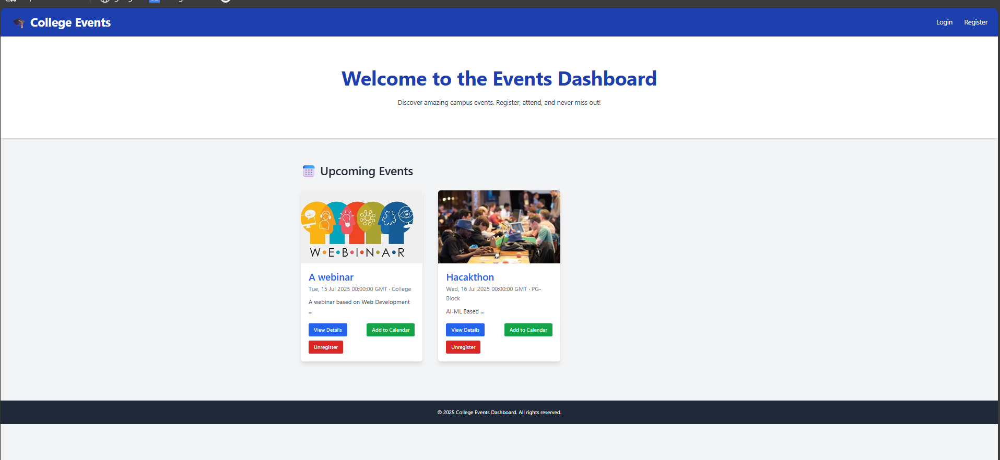
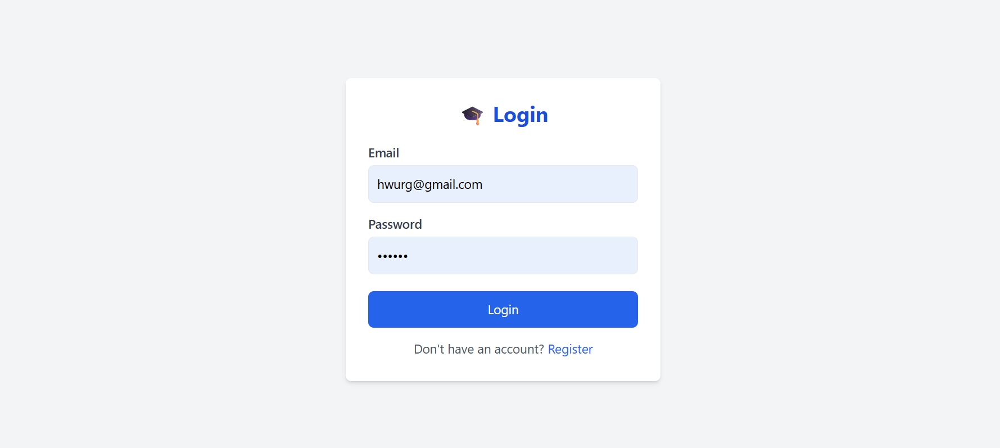
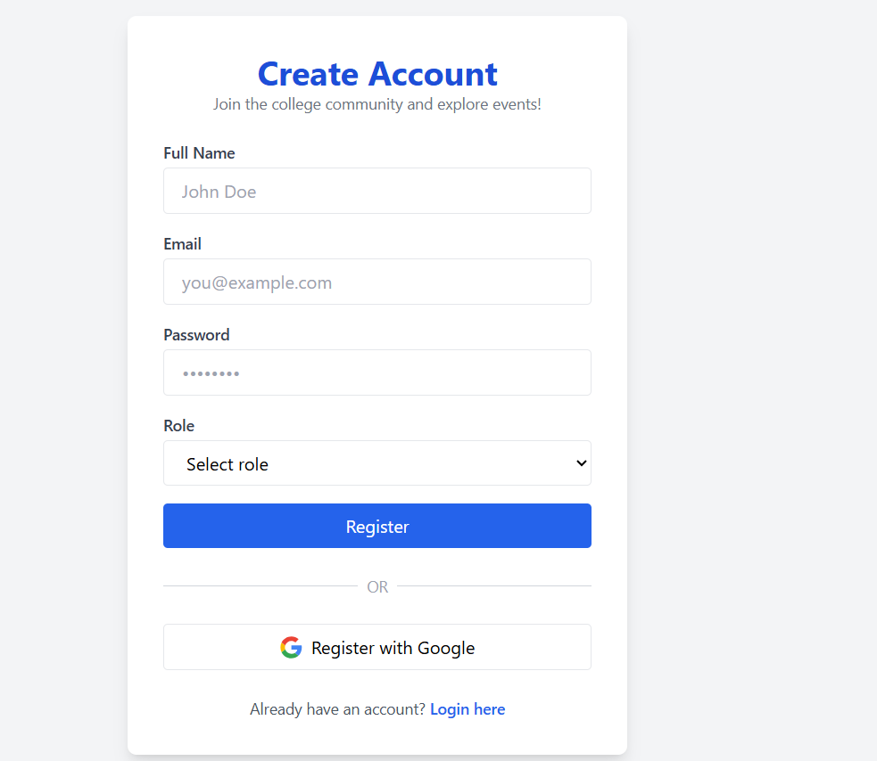
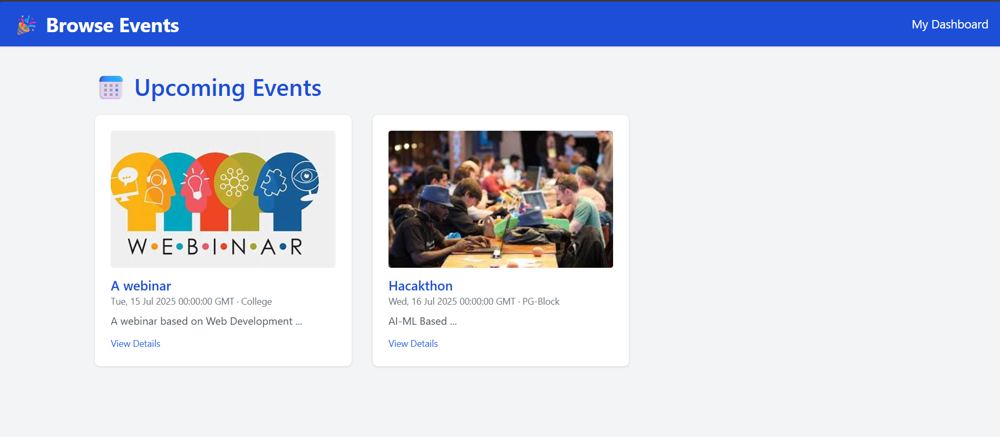
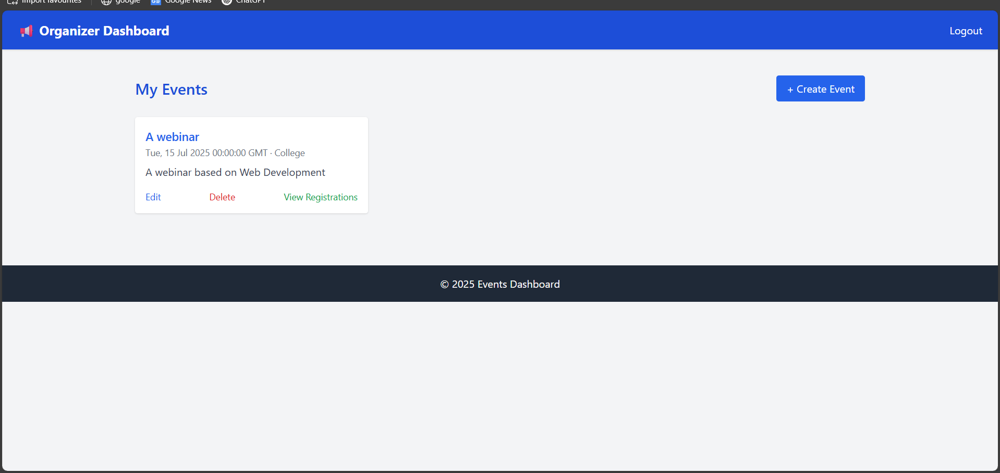
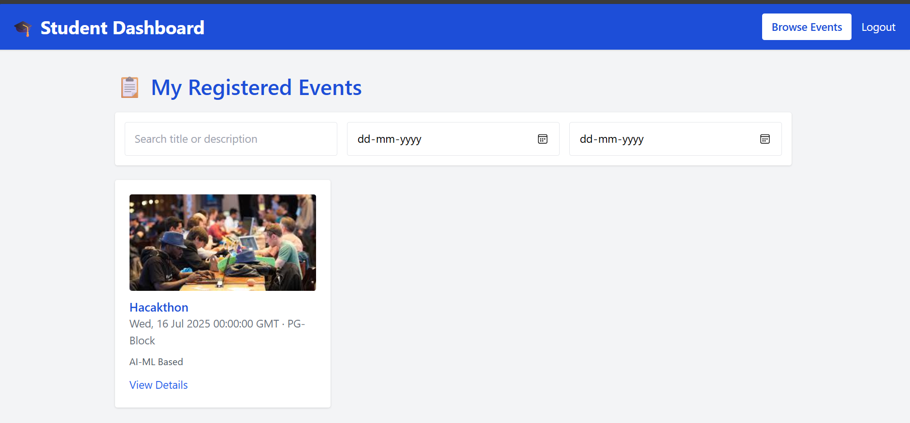
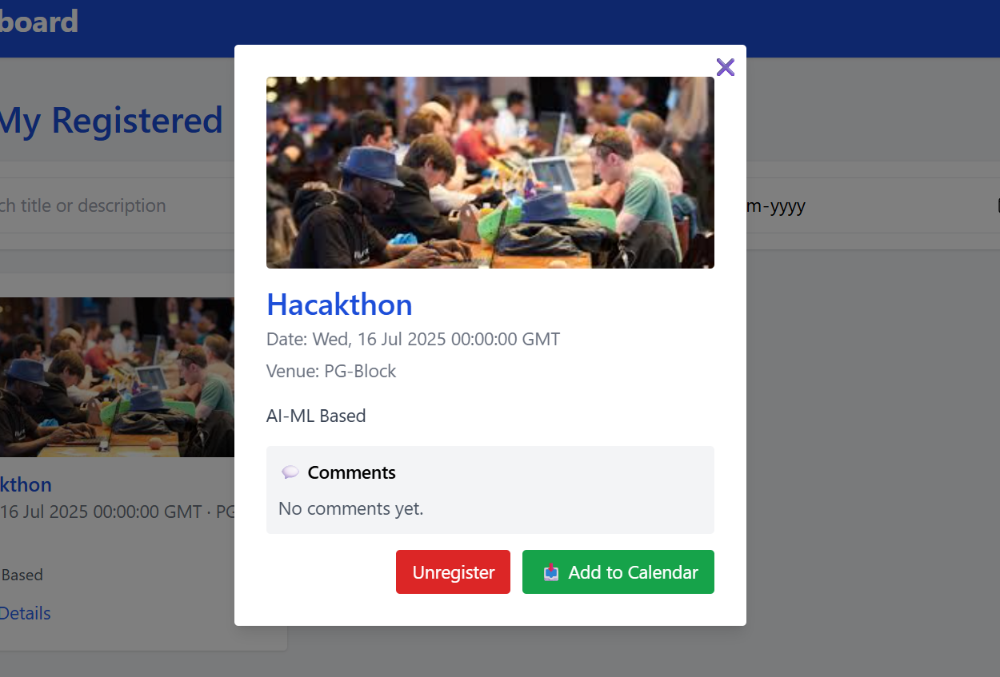

# 🎓 College Events Dashboard

🎓 College Events Dashboard
Tech Stack: Python, Flask, MySQL, HTML5, CSS3, JavaScript, Bootstrap, Jinja2, REST APIs

A full-stack event management system built for college use, enabling organizers to create, update, and manage events, and allowing students to browse, register, and interact through a clean and interactive interface. Includes role-based access, calendar integration, comment system, and image support for each event.


An interactive full-stack web application for managing and participating in college events. Built with **Flask** (Python), **HTML/CSS/JS**, and **MySQL**, this dashboard provides dedicated interfaces for both students and organizers.

---

## 🚀 Features

### 👨‍🎓 For Students:
- 🔍 **Browse Events**: Filter and search upcoming events by date, title, or venue.
- 📝 **Register & Unregister**: Join or leave events with one click.
- 💬 **Comment System**: Post and view feedback for events.
- 📅 **Calendar Integration**: View registered events in calendar format.
- 📥 **Add to Calendar**: Download `.ics` calendar files for any event.
- 🖼️ **View Event Details**: See image, organizer contact, and full description in a modern popup view.

### 👩‍💼 For Organizers:
- 🛠️ **Create/Edit/Delete Events**: Manage event listings and images.
- 📄 **View Registrations**: See list of students registered per event.
- 🖼️ **Upload Event Images**: Each event has a visual preview.

---

## 🧠 Why This Project?

This project showcases:
- 🔐 **Role-based authentication & redirection**
- ⚡ **Frontend ↔ Backend Integration using REST API**
- 🗃️ **CRUD operations & image upload with secure storage**
- 💡 **Dynamic UI using Tailwind CSS and FullCalendar.js**
- 🎯 **MySQL relationships, foreign keys & queries**

---

## 🛠️ Tech Stack

| Technology        | Description                    |
|------------------|--------------------------------|
| Python + Flask   | Backend server and APIs        |
| HTML/CSS + JS    | Frontend UI (Vanilla JS + Tailwind) |
| MySQL            | Relational database            |
| FullCalendar.js  | Calendar view for events       |
| Jinja2           | Flask templating engine        |

---

## 📁 Folder Structure


---

## 🎥 Project Screenshots

### 🏠 Home Page


### 🔐 Login Page


### 📝 Create Account


### 🎯 Browse Events


### 🧑‍💼 Organizer Dashboard


### 🎓 Student Dashboard


### 🔍 View Event


---

## 📖 How to Run Locally

### 🔄 Clone the repository

```bash
git clone https://github.com/EerthineniAnupama/College-Events-Dashboard.git
cd College-Events-Dashboard
```

🧪 Create & activate a virtual environment (optional but recommended)
```bash


python -m venv venv
venv\Scripts\activate    # On Windows
# or
source venv/bin/activate  # On Linux/Mac

```


📦 Install dependencies
```bash


pip install -r requirements.txt

Start the Flask server

python app.py
```

Visit http://127.0.0.1:5000 in your browser to explore the app!

---

🌟 Final Note
This project is built from scratch to showcase:

✅ Full-stack web development

🧠 Backend logic with Flask

🖼️ UI integration with clean frontend

🛢️ MySQL database operations

👥 Role-based functionalities (Students & Organizers)

📅 Event scheduling, registration, and calendar view

If you found this helpful or impressive, consider giving the repo a ⭐ star!


